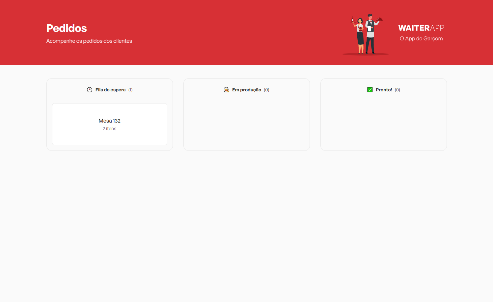
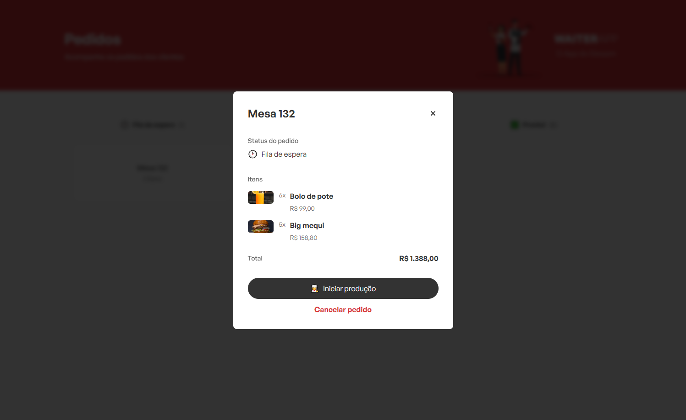
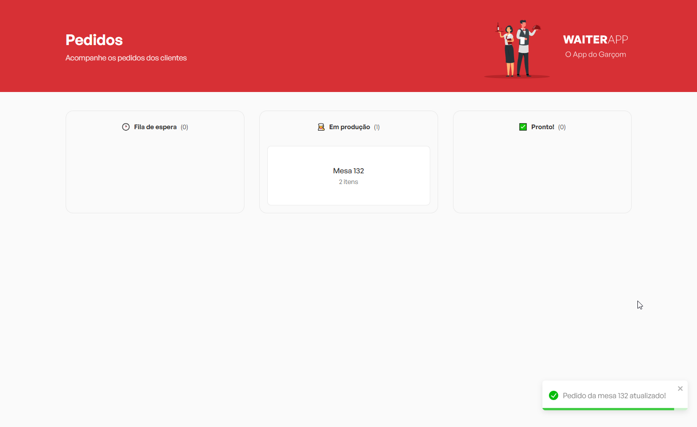
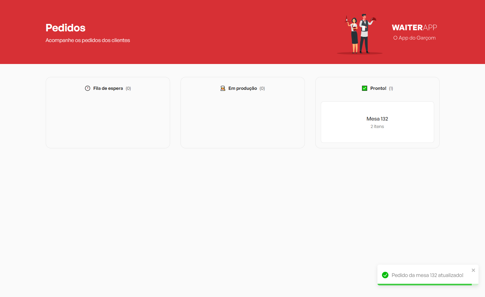
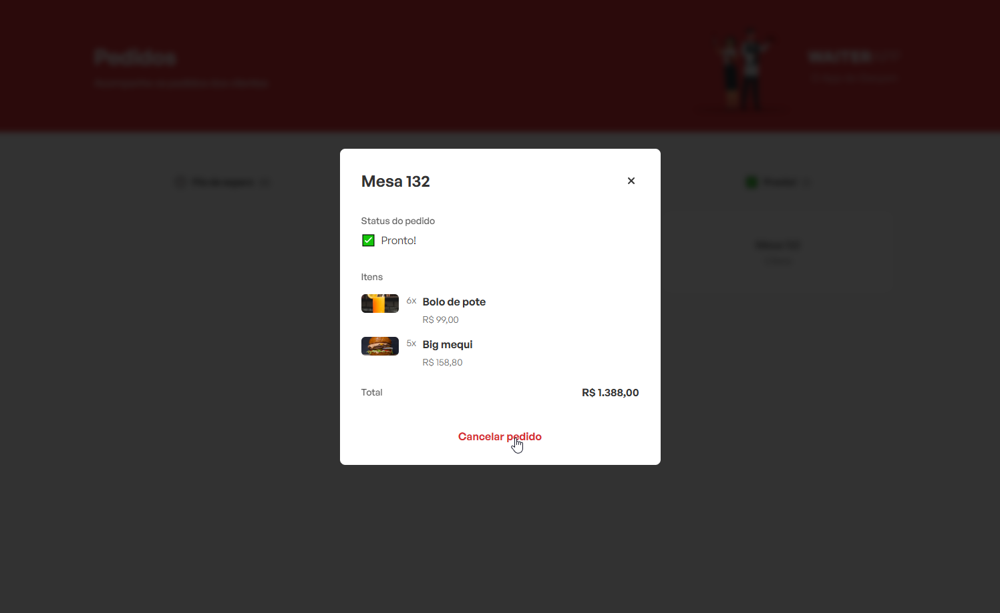
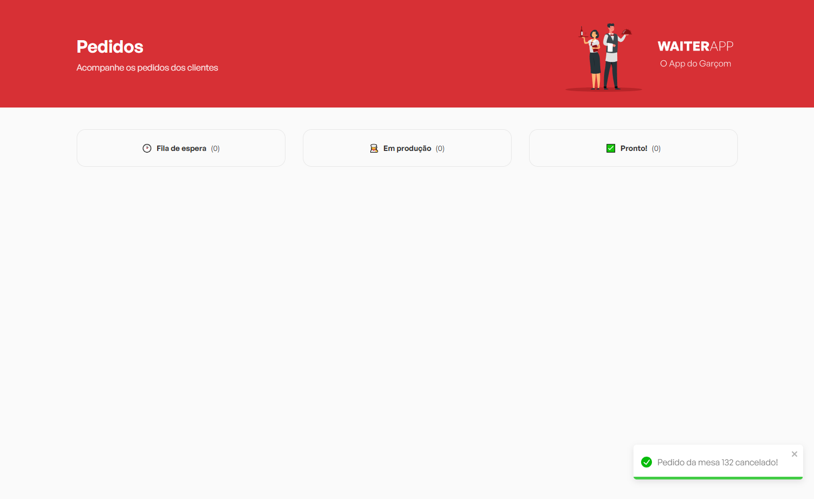

### References

This repo is part of the project "Waiter app", you can check the other repos here:

- [Waiter app API](https://github.com/abnerpersio/waiter-backend)
- [Waiter app mobile APP](https://github.com/abnerpersio/waiter-app)

### Links

[Figma - WaiterApp](https://www.figma.com/design/hJvsULkA3cDLNbTswLdTZP/Waiter-App-(2.0)-(Copia-local)?m=auto&t=gwbhwBpfrkPyzOju-1)

### Screenshots

---

---

---

---

---

---

